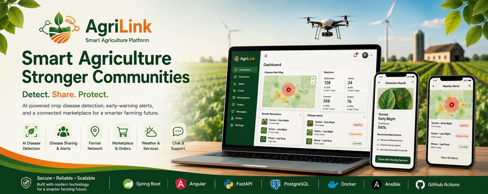

<div align="center">


# 🌱 AgriLink

### Smart Agriculture Platform for AI-Powered Crop Disease Detection, Farmer Collaboration & Agricultural Commerce

**Detect. Share. Warn. Protect.**



</div>

---

## 📖 Table of Contents

- [🎯 Project Vision](#-project-vision)
- [🚨 Core Concept](#-core-concept)
- [✨ Key Features](#-key-features)
  - [🤖 AI Plant Disease Detection](#-ai-plant-disease-detection)
  - [📢 Disease Sharing & Early Warning](#-disease-sharing--early-warning)
  - [🌾 Farmer Management](#-farmer-management)
  - [🛒 Agricultural Marketplace](#-agricultural-marketplace)
  - [🗺️ Farmer Discovery](#️-farmer-discovery)
  - [💬 Communication](#-communication)
  - [🛠️ Agricultural Services](#️-agricultural-services)
  - [🌦️ Weather](#️-weather)
  - [🔐 Authentication & Authorization](#-authentication--authorization)
  - [👨‍💼 Administration](#-administration)
  - [⭐ Reviews](#-reviews)
- [🏗️ System Architecture](#️-system-architecture)
- [🧰 Technology Stack](#-technology-stack)
- [🐳 Deployment Architecture](#-deployment-architecture)
- [⚙️ DevOps Architecture](#️-devops-architecture)
- [📊 Monitoring & Observability](#-monitoring--observability)
- [🛡️ Security](#️-security)
- [🧪 Testing Strategy](#-testing-strategy)
- [📁 Project Structure](#-project-structure)
- [🚀 Development Roadmap](#-development-roadmap)
- [🧭 Development Philosophy](#-development-philosophy)
- [📚 Documentation](#-documentation)
- [🎓 Portfolio Objectives](#-portfolio-objectives)
- [🌱 Future Vision](#-future-vision)
- [📌 Project Status](#-project-status)
- [👨‍💻 Author](#-author)

---

# 🎯 Project Vision

Agricultural diseases can spread rapidly while farmers may have limited
access to early information about outbreaks in their surrounding areas.

AgriLink aims to create a **connected agricultural ecosystem** where
farmers can:

- 🔬 Detect crop diseases using AI
- 📢 Share disease detections with nearby farmers
- 📍 Receive localized disease alerts
- 🗺️ Discover farmers and agricultural activity around them
- 🌾 Manage crops
- 🛒 Buy and sell agricultural products
- 🤝 Communicate with farmers and buyers
- 🌦️ Access weather information and agricultural recommendations
- 🛠️ Discover and offer agricultural services

The long-term objective is to transform individual disease detection
into a **community-based agricultural early-warning system**.

---

# 🚨 Core Concept

The most important workflow in AgriLink is the disease detection and
sharing system.

```text
                    FARMER
                       │
                       ▼
                Upload Crop Image
                       │
                       ▼
                ┌──────────────┐
                │   AI MODEL   │
                └──────┬───────┘
                       │
                       ▼
                Disease Detection
                       │
              ┌────────┴────────┐
              │                 │
           PRIVATE            SHARE
              │                 │
              ▼                 ▼
        Detection History   Disease Alert
                                │
                                ▼
                       Nearby Farmers
                                │
                                ▼
                         Early Warning
                                │
                                ▼
                         Crop Protection
